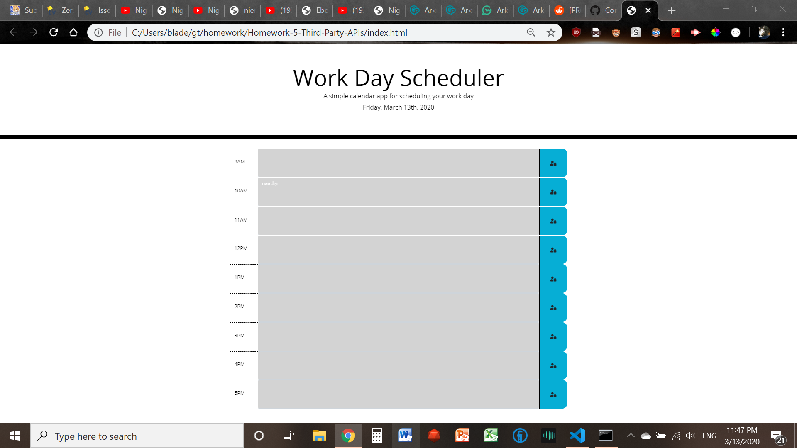
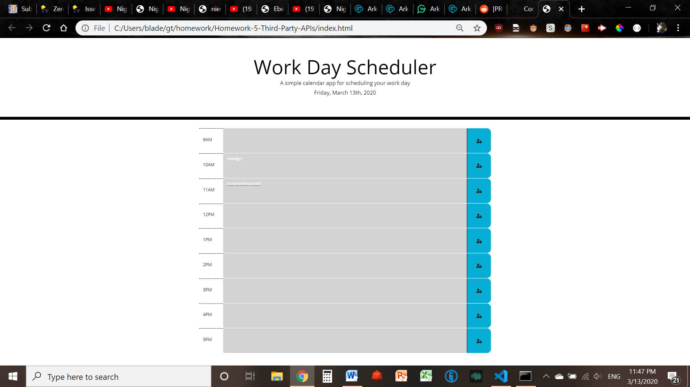
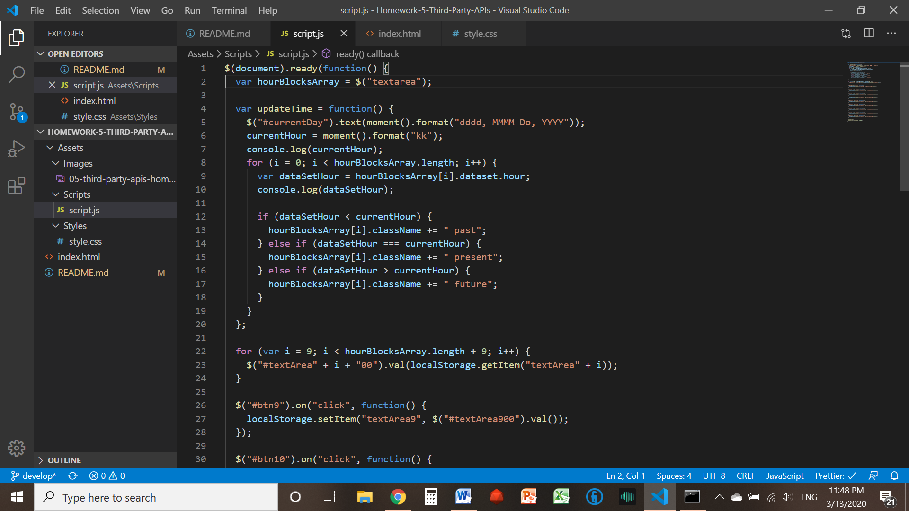

# Homework-5-Third-Party-APIs

This program is intended to create a self-updating day calendar of sorts. The idea here is that the user should be able to write text into the provided textareas, click on the button next to each of these textareas, and have their writing saved to localStorage. In addition, however, the page tracks the current date and hour using moment.js, dynamically updating the date it shows and the colors of the text fields in accordance with the current hour (which, admittedly, is only useful from 9am-5pm - but that, too, is on purpose). 

## Intended Usage

According to the user story that came bundled with this project, the intent of this program is to create a simple day planner-esque calendar. The shifting colors of the text fields are likely intended to help the prospective user with time and task management by providing a visual aid. 

## Screenshots

## Features

- Dynamically updated moment.js-powered calendar with text that persists across refreshes!
- Date displayed will always be accurate!
- Fun, productive-mindset-encouraging color shifts for the busy worker! 

## Link to Published Page

(https://fanofstuff.github.io/Homework-5-Third-Party-APIs/)

## How to Use

1. Simply open index.html, 
2. Type in your text into the appropriate field, 
3. And click the save button to the right of the field! 

Everything else is automatic! 

## Credits

© 2019 fanofstuff